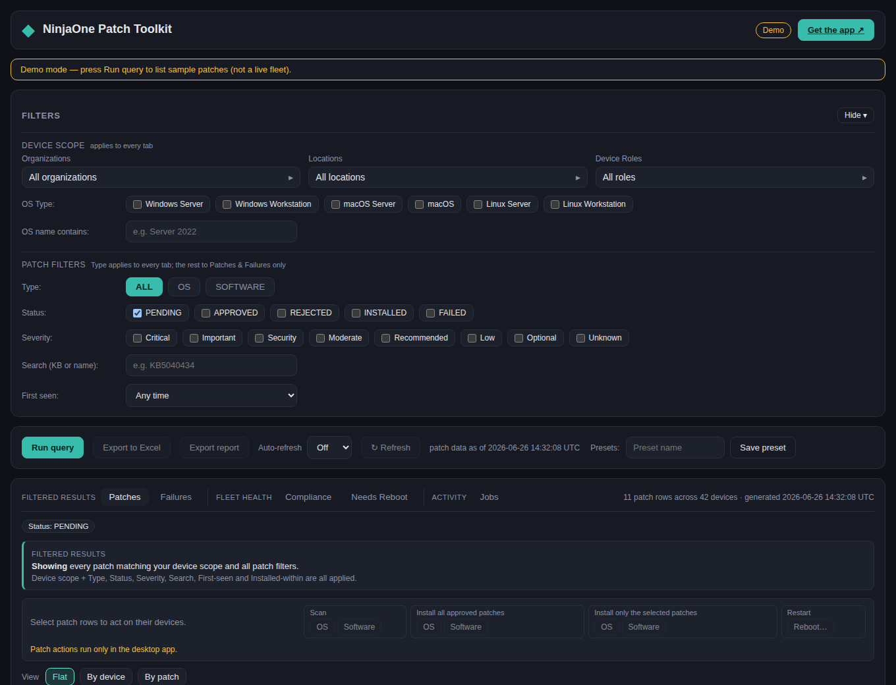

# NinjaOne Patch Toolkit

[](https://github.com/tiredithumans/ninjaone-patch-toolkit/actions/workflows/ci.yml)
[](https://github.com/tiredithumans/ninjaone-patch-toolkit/actions/workflows/codeql.yml)
[](#license)
[](https://tiredithumans.github.io/ninjaone-patch-toolkit/)

A native desktop toolkit (Rust / Leptos / Tauri 2) for patching‑operations teams. It
authenticates to the NinjaOne Public API with **OAuth 2.0 + PKCE**, filters the fleet,
lists individual patches per server, and exports to Excel.



> **[▶ Try the live web demo →](https://tiredithumans.github.io/ninjaone-patch-toolkit/)** — the full UI
> with sample data, right in your browser (no install, no sign-in). Press **Run query** to list the
> sample patches and try the filters. Live NinjaOne queries and Excel export need the native backend,
> so they're disabled in the hosted demo.

## Features

- **PKCE OAuth 2.0** against `/ws/oauth/authorize` + `/ws/oauth/token` (S256, loopback
  redirect). Read‑only scope `monitoring offline_access` by default; `management` is added
  only when you switch on **Patch actions**. Refresh token stored in the OS keyring; the
  client secret is optional (Native app registrations have none).
- **Advanced filtering** — Organization, Location, Device Role, and OS Type. OS Type is
  both the coarse NinjaOne node‑class facet (pushed into the `df` query) and a granular,
  client‑side OS‑name substring filter.
- **Per‑server patch listing** by **type** (All / OS / Software) and **status**
  (Pending / Approved / Rejected / Installed, plus Failed). Installed patches are pulled
  from the patch‑install history endpoints over a configurable window.
- **Excel export** (`.xlsx`) — a **Patches** detail sheet plus **Compliance**, **Compliance by
  OS**, **Needs Reboot** and **Patch Failures** summary sheets. Every sheet freezes its header
  row; the detail sheet also gets an autofilter, being the only one meant to be sliced by hand.
  A summary sheet is written only when it has rows.
- **Patching‑ops extras**
  - Install‑history export (what actually installed / failed) over a date window.
  - Reboot & failure views (devices pending reboot; `FAILED` patches).
  - Compliance & SLA aging — per‑org compliance % and aged Critical/Important backlog.
  - Saved filter presets and optional auto‑refresh.
- **Patch actions** *(opt‑in — see [Patch actions](#patch-actions))* — select patch rows and
  scan, apply, reboot, or run any script from the tenant's automation library, then watch
  each dispatch to a terminal state in the **Jobs** tab.

## Architecture

```
src-tauri/   Tauri 2 backend (Rust): auth (PKCE), NinjaOne API client, device↔patch
             join, xlsx export, IPC commands.
web-rs/      Leptos 0.8 (CSR) frontend, bundled by Trunk, talking to the backend over
             the global __TAURI__ invoke bridge.
```

Backend modules of note: `auth.rs` (PKCE + keyring), `api/` (client, pagination, lookups,
devices, patches, actions), `state.rs` (tenant‑stamped whole‑fleet + result caches),
`filter.rs` (`df` builder + client‑side facets), `rows.rs` (join → `PatchRow`, compliance,
SLA/severity/age rollups), `actions.rs` + `commands/actions.rs` (opt‑in device‑action
guardrails, dispatch and job polling), `export.rs` (`rust_xlsxwriter`), `report.rs`
(standalone HTML report).

## NinjaOne setup

Create an API client in NinjaOne: **Administration → Apps → API → Client App IDs → Add**.

- **Application Platform:** **`Native`** — a public client with no secret (recommended for a
  desktop app). The app also supports a **`Web`** (confidential) client if you'd rather use one
  with a secret.
- **Allowed grant types:** enable **Authorization Code** *and* **Refresh Token**. Authorization
  Code drives the interactive browser sign‑in; Refresh Token keeps you signed in without
  re‑authenticating every hour. (Don't pick a client‑credentials / machine‑to‑machine app — it has
  no authorization‑code flow, and the sign‑in page will 404.)
- **Scopes:** **`Monitoring`** (read‑only). The app additionally requests `offline_access` at
  sign‑in to obtain the refresh token. Add **`Management`** only if you intend to use
  [Patch actions](#patch-actions) — the app requests it solely when that feature is enabled.
- **Redirect URI:**
  - *Native:* not configurable — NinjaOne registers it as **`http://127.0.0.1`** and accepts any
    port (the app listens on `http://127.0.0.1:<callback port>`, default `11434`).
  - *Web:* register the redirect URI **exactly** as **`http://127.0.0.1:11434`** — `127.0.0.1`
    (not `localhost`), no trailing slash, matching the app's **Callback port**.

Copy the generated **Client ID** (and the **Client Secret** only if you chose `Web`).

> **Region/Instance must match your console.** The Client ID is only valid on the NinjaOne instance
> it was created on. In the app's **Settings**, set **Region/Instance** to the host you sign in to
> NinjaOne at (the host in your browser's address bar — e.g. `https://us2.ninjarmm.com`). If sign‑in
> reports a **404**, NinjaOne didn't recognize the Client ID at that host — re‑check the
> Region/Instance and that the Client ID belongs to a Native, Authorization‑Code app.

## Prerequisites

- Rust **1.98** with the `wasm32-unknown-unknown` target (pinned in `rust-toolchain.toml`).
- [`trunk`](https://trunkrs.dev), the Tauri CLI (`cargo install tauri-cli`), and a matching
  `wasm-bindgen-cli` (`cargo install wasm-bindgen-cli --version <lockfile version>`).
- Platform webview deps (WebKitGTK on Linux; bundled on macOS/Windows).

## Run

```sh
just dev          # launches the desktop app (Tauri auto-starts `trunk serve`)
# or, separately:
just web-serve    # frontend dev server on http://localhost:8080
```

On first launch open **Settings**, pick your **Region/Instance** (e.g. `us2`), paste the
**Client ID** (and Secret if applicable), then **Sign in** to complete the PKCE browser
flow.

Sign-in hanging, a 404, an empty export, or blank fields? See
[docs/TROUBLESHOOTING.md](docs/TROUBLESHOOTING.md).

## Build & verify

```sh
just build        # distributable bundles (.dmg/.app, .msi/.nsis, AppImage)
just verify       # every CI gate (format, lint, tests — both crates)
just test         # backend unit + wiremock integration tests
just coverage     # backend test coverage (cargo-llvm-cov) → summary + lcov report
```

**Platform support:** released macOS builds are **Apple Silicon (arm64) only** — there is no
Intel (x86_64) binary. Windows (.msi/.nsis) and Linux (AppImage) are x86_64. Building from
source works on any platform Tauri supports, including Intel Macs.

## Patch actions

Off by default. The toolkit is a read‑only reporting tool until you enable this in
**Settings → Patch actions**, and an install that never opens that panel keeps requesting
the read‑only scope.

**Enabling it:**

1. Add the **`Management`** scope to your API app in NinjaOne (**Administration → Apps →
   API**). Without it the write endpoints return 403.
2. Switch on **Patch actions** in Settings and save.
3. Choose **Re‑authorize**. This step is not optional: the OAuth refresh grant never
   re‑sends `scope`, so an existing sign‑in keeps its read‑only grant until you consent
   again.

**What you can do.** Tick patch rows in the **Patches** tab, then use the action bar. Ticking
a row selects both that row's **patch** and its **device** — which of the two an action acts on
is the single most important thing to know here, so read
[Install all vs install only the selected](#install-all-vs-install-only-the-selected) before
using either.

The action bar groups the buttons by **mechanism**, because that is what decides the blast radius —
and each button names its own reach (*All OS* installs everything approved; *Selected OS* installs
only what you ticked), states it in full in its tooltip, and repeats it as the first line of the
confirmation dialog:

| Action bar group | Action | Endpoint | Notes |
|---|---|---|---|
| **Scan** | OS / Software | `POST /device/{id}/patch/{os,software}/scan` | Read‑only on the device; no confirmation needed. |
| **Install all approved patches** | OS / Software | `POST /device/{id}/patch/{os,software}/apply` | Installs **every approved patch** on the device, not just the ones you ticked. |
| **Install only the selected patches** | OS / Software | `POST /device/{id}/script/run` (remediation script) | Installs only the patches ticked **on that device**. Needs a configured script ID. |
| *(not grouped)* | Reboot | `POST /device/{id}/reboot/{mode}` | Requires a reason, recorded in NinjaOne's activity feed. `FORCED` needs a typed confirmation. |
| *(not grouped)* | Run script | `POST /device/{id}/script/run` | Any script in the tenant's automation library. |

Confirmation dialogs, the Jobs tab and the audit log name these more precisely — *Apply all OS
patches* vs *Apply selected OS patches*, and so on for software.

### Install all vs install only the selected

NinjaOne's API has **no per‑patch apply endpoint**. `/patch/{os,software}/apply` installs
everything approved on the device and cannot be told which patches to install — so ticking one
row and pressing **Apply all OS patches** installs that device's entire approved backlog.

Installing a specific subset is possible only by running a library script that takes a target
list. Because those are different mechanisms with different blast radii, they are separate
actions under separate headings in the action bar, and the toolkit warns when you pick the
untargeted one while holding a partial selection:

- **Install all approved patches** — native endpoint, whole approved backlog, no preview, runs
  as NinjaOne's agent (the shared *Run as* / *Dry run* options do not reach it).
- **Install only the selected patches** — remediation script, only the ticked patches, and each
  device receives only *its own* ticked patches rather than the union of the selection.

A device with nothing ticked of that patch family is dropped from a targeted apply rather than
being sent an empty list.

### Setting up the remediation scripts

NinjaOne has **no script‑upload API**, so add the scripts by hand under **Administration →
Library → Automation**, then paste each numeric ID (from the script's URL) into **Settings →
Patch actions**. Two IDs are configured separately, because the two patch families are targeted
differently:

| Setting | Script variables it must declare | How targets are passed |
|---|---|---|
| **OS patch script ID** | `kbAllowList`, `rebootBehavior`, `dryRun` (String/Overridable) | `kbAllowList=5034123,5034567` — comma‑separated KB numbers |
| **Software patch script ID** | `productAllowListB64`, `rebootBehavior`, `dryRun` | `productAllowListB64=<base64>` — titles joined by `\|`, then base64‑encoded |

Third‑party patches carry no KB number, which is why software targets are matched by **product
title** and base64‑encoded: NinjaOne splits the `parameters` string on spaces, and product
titles contain spaces. An OS remediation therefore skips third‑party patches and vice versa.

An unset script ID is a hard blocker on the corresponding action, not a silent no‑op, and the
IDs are resolved from Settings in the backend — never taken from the request.

**Targeting KBs from the generic Run script action** works too: the toolkit reads
`/automation/scripts` and offers per‑KB targeting only for scripts that declare a
`kbAllowList` variable.

**Guardrails**, all enforced in the Rust backend rather than the UI:

- Dry run is the default for scripts. The native endpoints have no preview mode, so a
  "dry run" of them is refused outright instead of pretending.
- Every mutating action needs a confirmation token bound to that exact device set and
  parameter string, single‑use and valid for five minutes.
- Blast‑radius cap (default 25 devices) and org‑span cap (default 1) are hard blockers.
- Offline devices are skipped by default — NinjaOne *queues* work for them, so an action
  sent now can restart a machine hours later.
- An optional maintenance window gates every change.
- A dispatch whose POST times out is recorded as **Unknown** and never retried: it may
  already be running on the device.

There is no script‑output endpoint in the NinjaOne v2 API, so the Jobs tab reports the exit
code and links you to the activity/job ID to look the run up in the NinjaOne console.

## Security

- Access tokens are kept in memory; the refresh token and optional client secret live in
  the OS keyring (Keychain / Credential Manager / Secret Service). Nothing sensitive is
  written to `settings.json`.
- The app requests read‑only (`monitoring`) scope unless **Patch actions** is enabled, which
  adds `management`. Turning the feature off returns it to read‑only at the next sign‑in.
- Every dispatched action is appended to `action-audit.jsonl` beside `settings.json`, with
  credential‑shaped script parameters redacted. Tokens are never written there. The
  **Jobs** tab renders it under *Audit trail*; unlike the per-session job list it survives a
  restart and **Clear history** does not touch it.
- Rolling daily logs are written to `logs/` in the same directory (seven days kept).
  **Settings → Open diagnostics folder** reveals them — that is what to attach to a bug report,
  since a bundled app launched from Finder or the Start menu has nowhere for stdout to go.

## Updates

The app checks GitHub for a newer release on launch and offers to install it, showing the new
version's release notes first. Toggle the launch check under **Settings → Automatically check for
updates**, or click **Check for updates** there anytime. Updates are signed (minisign) and verified
before they install, and only apply once a release is published — so a draft release never ships to
users.

## Contributing

Issues and PRs are welcome — see [CONTRIBUTING.md](CONTRIBUTING.md) and
[AGENTS.md](AGENTS.md) (the conventions every contributor follows). Run
`just verify` before opening a PR. Report security issues privately via the
[security advisory flow](https://github.com/tiredithumans/ninjaone-patch-toolkit/security/advisories/new),
not a public issue (see [SECURITY.md](.github/SECURITY.md)).

## License

Licensed under either of

- Apache License, Version 2.0 ([LICENSE-APACHE](LICENSE-APACHE) or
  <http://www.apache.org/licenses/LICENSE-2.0>)
- MIT License ([LICENSE-MIT](LICENSE-MIT) or <http://opensource.org/licenses/MIT>)

at your option.

Unless you explicitly state otherwise, any contribution intentionally submitted
for inclusion in this work by you, as defined in the Apache-2.0 license, shall be
dual licensed as above, without any additional terms or conditions.
